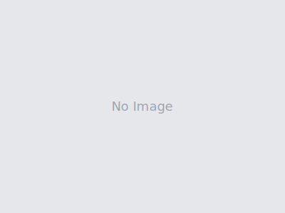

# Haawwaa Galaan – Official District Website

<p align="center">
  
</p>

<p align="center">
  Official website for <strong>Aanaa Haawwaa Galaan</strong>, Qellem Wallaggaa Zone, Oromia Region, Ethiopia.
  Built with Laravel 11, Tailwind CSS, and Alpine.js.
</p>

<p align="center">
  
  
  
  
  
</p>

---

## Overview

This is a full-stack content management system (CMS) for the Haawwaa Galaan district administration. It allows administrators to manage all website content through a secure admin panel — including news posts with multiple photos, leader profiles, tourism attractions, farming items, services, and page sections.

---

## Features

### Public Website
- **Hero Slideshow** — Full-screen image carousel with auto-play
- **About Section** — District history and statistics
- **Leaders** — Sector leaders with photos and descriptions
- **Services** — Government services offered
- **News & Announcements** — Posts with multiple photo galleries and full detail pages
- **Charity Section** — Community service gallery
- **Hospital Section** — Hospital facilities showcase
- **Football Championship** — Sports gallery
- **Tourism** — Attraction cards with features
- **Farming** — Agricultural products showcase
- **Biography** — Historical figure profile page
- **Contact** — Contact form and office information
- **Scroll animations** — Smooth fade-in and hover effects on all cards

### Admin Panel
- Secure login with session authentication
- **Dashboard** — Overview of all content
- **Hero Slides** — Upload/replace/remove slideshow images
- **Page Sections** — Edit all text and images per page
- **Leaders** — Full CRUD with photo upload and drag-to-reorder
- **Services** — Full CRUD
- **Farming Items** — Full CRUD with image upload
- **Tourism Attractions** — Full CRUD with features list
- **News Posts** — Full CRUD with cover image + multiple extra photos
- **Hospital Photos** — Upload facility images
- **Football Gallery** — Upload championship photos
- **Contact Info** — Edit address, phone, email, social links
- **Media Library** — Browse all uploaded files

---

## Tech Stack

| Layer | Technology |
|-------|-----------|
| Backend | Laravel 11 (PHP 8.2+) |
| Frontend | Blade, Tailwind CSS 3, Alpine.js |
| Database | MySQL 8 (SQLite for local dev) |
| Auth | Laravel Breeze |
| Build | Vite |
| Server | Nginx / Apache (Plesk compatible) |

---

## Requirements

- PHP 8.2+
- Composer
- Node.js 18+ & npm
- MySQL 8+ (or SQLite for local)

---

## Installation

### 1. Clone the repository

```bash
git clone https://github.com/your-username/haawwaa-galaan.git
cd haawwaa-galaan
```

### 2. Install dependencies

```bash
composer install
npm install
```

### 3. Configure environment

```bash
cp .env.example .env
php artisan key:generate
```

Edit `.env` with your database credentials:

```env
DB_CONNECTION=mysql
DB_HOST=127.0.0.1
DB_PORT=3306
DB_DATABASE=haawwaa_galaan
DB_USERNAME=root
DB_PASSWORD=your_password

ADMIN_PASSWORD=Admin@1234
```

### 4. Create database and run migrations

```bash
# Create the database first (MySQL)
mysql -u root -p -e "CREATE DATABASE haawwaa_galaan CHARACTER SET utf8mb4 COLLATE utf8mb4_unicode_ci;"

# Run migrations and seed
php artisan migrate --seed
```

### 5. Build assets

```bash
npm run build
```

### 6. Start the development server

```bash
# Terminal 1
php artisan serve

# Terminal 2
npm run dev
```

Visit `http://localhost:8000`

---

## Admin Access

After seeding, log in at `/login`:

| Field | Value |
|-------|-------|
| Email | `admin@haawwaagalaan.gov.et` |
| Password | Value of `ADMIN_PASSWORD` in `.env` (default: `Admin@1234`) |

---

## Project Structure

```
haawwaa-galaan/
├── app/
│   ├── Http/
│   │   └── Controllers/
│   │       ├── Admin/          # Admin CRUD controllers
│   │       └── PageController  # Public page controllers
│   └── Models/                 # Eloquent models
├── database/
│   ├── migrations/             # Database schema
│   └── seeders/                # Initial data seeder
├── public/
│   └── images/                 # Uploaded images (not in git)
├── resources/
│   └── views/
│       ├── admin/              # Admin panel views
│       ├── layouts/            # Base layouts
│       ├── pages/              # Public page views
│       └── partials/           # Nav, footer
└── routes/
    └── web.php                 # All routes
```

---

## Deployment (Plesk / Shared Hosting)

1. Upload all files to `httpdocs/laravel/`
2. Set document root to `httpdocs/laravel/public/` or configure `httpdocs/index.php` to point to Laravel
3. Create `httpdocs/images/` folder (writable)
4. Set `.env` with production database credentials
5. Run migrations via a temporary PHP script or SSH
6. Set folder permissions: `storage/` and `bootstrap/cache/` must be writable

---

## Image Storage

Images are stored directly in `public/images/` (or `httpdocs/images/` on the server) — no Laravel storage symlink required. This makes it compatible with shared hosting environments like Plesk.

---

## License

MIT License — free to use and modify.

---

## Credits

Developed for **Bulchiinsa Aanaa Haawwaa Galaan**, Qellem Wallaggaa, Oromia, Ethiopia.
